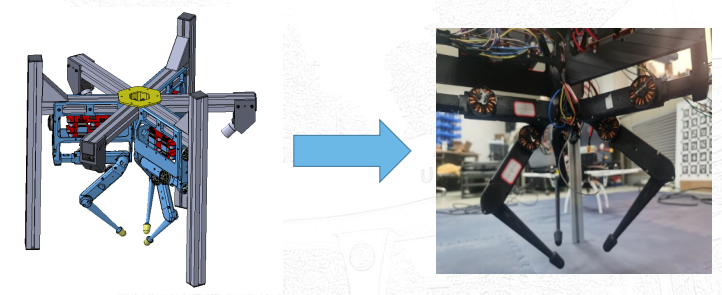
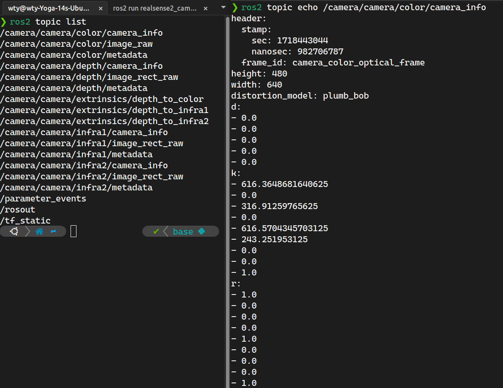
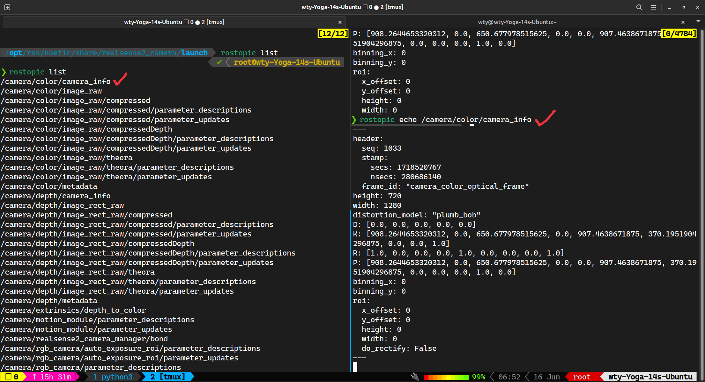

# 三指机器人参考文档

> 当前还在学习万强所完成的工作，项目完善中。。。

## 机器人硬件安装

> 教程 [GitHub - open_robot_actuator_hardware](https://github.com/open-dynamic-robot-initiative/open_robot_actuator_hardware)，论文 [TriFinger: An Open-Source Robot for Learning Dexterity](https://arxiv.org/abs/2008.03596)



每个1个开发板 `F28069M` 可以最多控制2个驱动板 `DRV8305EVM`，每个驱动板控制一个电机 `MN4004 300KV`，每个电机还需要一个编码器 `AEDT-981x` 通过检测一个连接电机的转片来获取当前手臂位置和速度信息，每个手臂三个自由度，每个自由度需要一个电机控制，则需要9个电机。

按照手臂将整个机器分为3大块，每一块需要3个电机，因此需要2个开发板和1个驱动板，所以总共需要 `2*3` 个开发板，9个驱动板，9个电机。

### 电机处理

[电机改装教程](https://github.com/open-dynamic-robot-initiative/open_robot_actuator_hardware/blob/master/mechanics/actuator_module_v1/details/details_motor_preparation.md#details-motor-preparation)：先将转子（Rotor）和定子（Stator）拆分出来，分别进行处理

- 转子：将转子中间的孔径增大，把[加长的定制电机轴](https://github.com/open-dynamic-robot-initiative/open_robot_actuator_hardware/blob/master/mechanics/actuator_module_v1/drawings/motor_shaft.PDF)插进去。s
- 定子：将定子原本的三相线拆下来，焊接到更长的三相线上。

改装了电机还需要制作对应的执行器模块，需要使用两个半径大小1:3的减速齿轮，总共达到1:9的减速效果，从而能加强力矩输出效果，此部分逐步安装教程请见 [Step-by-Step Instructions](https://github.com/open-dynamic-robot-initiative/open_robot_actuator_hardware/?tab=readme-ov-file#step-by-step-instructions)。

### 接线

- 每个电机需要三相电通电（3根）连接到驱动板上
- 每个驱动板需要电源线通电（2根）连接外置电源（电压至少为23V，充电能到25V）
- 每个编码器需要 5v 线和接地线+3根通道线（5根）连接到开发板上
- 每个开发板需要连接CAN通讯线（2根）连接到GCAN设备（交换机）上

综上，一个手臂的数字控制组件包含 `3*3+2*3+5*3+2*2=34` 根线，总共需要 `34*3=102` 根线。

## 软件

### 开发板程序烧录

## 相机

我们需要两个（可以更多）摄像头 `D435`（`D435i` 也一样） 对方块位置进行识别，需要对相机的內外参进行标定，这些参数标定需要在 Linux 系统下进行。

### ROS2+RealSense获取内参矩阵（可跳过）

[[教程]安装realsense-ros](https://github.com/IntelRealSense/realsense-ros?tab=readme-ov-file#installation-on-ubuntu)，realsense-SDK 是用于相机可视化与获取相机内参，需要依赖 ROS 与相机进行通讯，我们根据上述教程进行安装：

1. **ROS2 安装**：我们安装的是 [ROS2 Humble](https://docs.ros.org/en/humble/Installation/Ubuntu-Install-Debians.html)（这个相比 [ROS2 Iron](https://docs.ros.org/en/iron/Installation/Ubuntu-Install-Debians.html) 有更长的维护时间）
   1. **安装**：直接进入[官方的安装教程](https://docs.ros.org/en/humble/Installation/Ubuntu-Install-Debians.html#install-ros-2-packages)中，顺次执行下来即可，注意安装 `sudo apt install ros-humble-desktop` 时候可能会爆版本过高的问题，我们可以先安装 `sudo apt install aptitude` 用于包版本降级，再使用 `sudo aptitude install ros-humble-desktop` 进行安装（如此安装需要要对安装策略进行选择，当看到 `ros-humble-desktop` 在 `uninstall` 列表中时，按 `n` 回车，让其继续给出新的安装策略，直到 `ros-humble-desktop` 不再 `uninstall` 中时，按 `y` 回车）
   2. **环境变量**：安装完成 `ros-humble-desktop` 后还需要执行 `source /opt/ros/humble/setup.bash` 对环境变量进行更新，由于我用的是 `zsh`，所以执行 `source /opt/ros/humble/setup.zsh` 即可。如果不想每次都 `source` 一次可以直接将 `source source /opt/ros/humble/setup.zsh` 加入到 `~/.zshrc` 中（如果是 bash 则加入到 `.bashrc` 中）
   3. **简单测试**：在一个终端中打开一个小乌龟测试器 `ros2 run turtlesim turtlesim_node`，再开一个终端打开 `ros2 run turtlesim turtle_teleop_key` 控制器（节点），对里面按上下左右即可对小乌龟进行控制了！
2. **安装 RealSense™ SDK 2.0**：[安装教程](https://github.com/IntelRealSense/librealsense/blob/master/doc/distribution_linux.md#installing-the-packages)，只需安装 `librealsense2-dkms` 和 `librealsense2-utils` 即可，输入命令 `realsense-viewer` 即可打开相机显示的可视化界面（连接相机即可看到画面，包含图像及深度图）
3. **向 ROS2 中安装 RealSense wrapper**：我的是 `humble` 版本，所以直接安装 `sudo apt install ros-humble-realsense2-*` 即可。

参考[ubuntu20.08下获取realsense内参（使用ros功能包）](https://blog.csdn.net/weixin_42691563/article/details/126818521)：我们需要用 type-c 3.0 （必须 3.0 哈）的 USB 线连接摄像头和电脑，运行命令 `ros2 run realsense2_camera realsense2_camera_node` 即可将当前相机加入 ROS 中的节点，然后通过 `ros2 topic list` 查看当前节点相关的话题，我们可以看到如下这些话题，再开个新的终端执行 `ros2 topic echo /camera/color/camera_info` 获取到当前相机相关参数，其中内参矩阵为 `k` 后面的 9 个参数，分别为 $3\times 3$ 的内参矩阵横向展开的结果。



例如上图中，我的相机内参矩阵就是 `k=[[616.3648681640625,0.0,316.91259765625],[0.0,616.5704345703125,243.251953125],[0.0,0.0,1.0]]`：
$$
K=\begin{bmatrix}
616.36&0&316.91\\
0&616.57&243.25\\
0&0&1
\end{bmatrix}
$$

### [Docker] ROS1+RealSense+Kalibr获取内参及畸变矩阵

我们需要使用 Kalibr 工具箱获取相机的畸变矩阵，安装 Kalibr 方法如下，参考[官方教程](https://github.com/ethz-asl/kalibr/wiki/installation)，两种方法我都进行了尝试，首先尝试的就是直接编译安装，再是Docker安装。

**直接编译安装 Kalibr（失败😢）**：但是最后发现系统自带的 Python 版本为 3.10，然而编译时候必须要用到一个叫 Boost 的工具包必须要 Python 3.8 版本，所以需要将其降级，最终但安装 ROS1 又会自动安装新版本，因此没有解决办法（失败过程如下）：

1. 安装 ROS1：参考[BiliBili - Ubuntu 22.04 apt 安装 ros1 ros Noetic Ninjemys](https://www.bilibili.com/read/cv30135783/)
2. 安装 Python 相关包：我用 `mamba`（`conda` 也一样）创建一个新的 `python 3.8.*` 的环境，使用 `pip` 安装这些依赖包：`pip install catkin-tools osrf-pycommon scipy matplotlib wxpython pyx `

3. 遇到报错
   - `fatal error: libv4l2.h: No such file or directory`：`sudo apt install libv4l-dev`
   - `fatal error: pyconfig.h: No such file or directory`，需要找到 `pyconfig.h` 文件位置，使用 `find /usr/include -name pyconfig.h` 产看返回结果，例如我返回的是 `/usr/include/python3.10/pyconfig.h` 说明该文件在 `/usr/include/python3.10/` 文件夹下，根据 [overflow的解答](https://stackoverflow.com/a/22674820) 加入环境变量：`export CPLUS_INCLUDE_PATH="$CPLUS_INCLUDE_PATH:/usr/include/python3.10/"` 
   - `fatal error: boost/detail/endian.hpp: No such file or directory`：和上面的问题类似，只需要找到 `boost/detail/endian.hpp` 所在的路径，例如我的就在 `/usr/include/` 下，加入到 C++ 链接库中即可`export CPLUS_INCLUDE_PATH="$CPLUS_INCLUDE_PATH:/usr/include/"`，**注意**：我的 `/detail` 目录下没有 `endian.hpp`，所以我又做了个软链接映射过去：`sudo ln -sf /usr/include/boost/endian.hpp /usr/include/boost/detail/endian.hpp`
   - `fatal error: stdlib.h: No such file or directory`：和上面类似，找到 `stdlib.h`，加入：`CPLUS_INCLUDE_PATH="$CPLUS_INCLUDE_PATH:/usr/include/c++/11/"`
   - 仍然使用 `boost` 编译时始终爆出 `libboost_python310.so.1.74.0 (3.10, Boost_PYTHON_VERSION=3.8)` 的错误，后来又尝试下载 `boost` 手工编译 `python 3.8` 的版本，但仍然报错，最后只好放弃。

**Docker安装Kalibr（成功）**：注意 Docker 安装的仅仅是 Kalibr，还是需要利用宿主机上安装的 ROS1 对相机数据进行获取。

1. 安装 ROS1：参考[BiliBili - Ubuntu 22.04 apt 安装 ros1 ros Noetic Ninjemys](https://www.bilibili.com/read/cv30135783/)

2. 安装 Docker：参考[腾讯云 - 最详细的ubuntu安装docker教程](https://cloud.tencent.com/developer/article/2309562)，一定要记得**配置用户组**，不然每次使用时候前面都加个 `sudo`。

3. 更新 Docker 镜像站与 DNS 地址：参考[CSDN - Docker拉取镜像过慢或卡死的坑！！！（亲测有效）](https://blog.csdn.net/m0_65933139/article/details/130181525)，源只需要一个即可，我用的是 `https://ustc-edu-cn.mirror.aliyuncs.com`，**DNS 一定要检查下是否被修改**过。

4. Docker-Kalibr 安装：参考[官方教程 - Using the Docker Images](https://github.com/ethz-asl/kalibr/wiki/installation#using-the-docker-images)，可视化[CSDN - 如何可视化docker：以ROS环境为例（例如Gazebo，Rviz）](https://blog.csdn.net/zkk9527/article/details/121159353)，

   ```bash
   FOLDER=/home/wty/Programs/kalibr/data  # 本地数据保存路径（**修改成你的哈**）
   xhost +local:root  # 修改X11渲染主机权限为root，用于可视化ROS图像
   docker run -it \  # 启动交互窗口 
   	--privileged \  # 获取宿主机的管理员权限，从而可以获取外部设备信息
   	--net=host \  # 使用宿主机的网络，从而可以通过设置http_proxy和https_proxy直接使用代理
   	-e "DISPLAY" -e "QT_X11_NO_MITSHM=1" \  # 一些用于可视化的环境变量
   	-v "/dev:/dev" \  # 获取宿主机设备信息，从而可以读取到摄像头
       -v "/tmp/.X11-unix:/tmp/.X11-unix:rw" \  # X11可视化转发
       -v "$FOLDER:/data" \  # 将/data转发到本地的数据保存路径
       kalibr  # 启动的镜像名称
   # 写成一行
   docker run -it --privileged	--net=host -e "DISPLAY" -e "QT_X11_NO_MITSHM=1" -v "/dev:/dev" -v "/tmp/.X11-unix:/tmp/.X11-unix:rw" -v "$FOLDER:/data" kalibr
   ```

5. Docker 环境变量加载：

   ```bash
   source devel/setup.bash
   ```

   可以将这句话加到 `~/.bashrc` 中，注意我们修改了容器的内容后，需要对镜像使用 `docker commit kalibr kalibr:v1` 更新，例如这样就是更新镜像名称从 `kalibr -> kalibr:v1`，下一次我们打开容器就从新的镜像 `kalibr:v1` 中打开即可，删除多余镜像方法参考 [如何优雅地删除Docker镜像和容器（超详细）](https://blog.csdn.net/u014282578/article/details/127866389)，相机标定文件 [下载链接](https://github.com/ethz-asl/kalibr/issues/514)

6. 我们还需要安装 RealSense™ SDK 2.0，顺着[官方教程 - Linux Distribution](https://github.com/IntelRealSense/librealsense/blob/master/doc/distribution_linux.md#installing-the-packages)安装完成 `librealsense2-dkms, librealsense2-utils`，再连接摄像头，运行命令 `realsense-viewer` 看是否可以出现如下可视化界面，说明安装成功（记得把左边的摄像头功能开关打开）：

<div align='center'>
   </image>
   </image>
</div>
   


#### 内参矩阵获取

 在 ROS 中将摄像头加入话题（ROS 是一个控制系统，需要将每个设备手动打开，打开后成为一个 node，使用 `rosnode list` 查看，每个 node 还具有很多相关 topic，可以获取其参数信息，通过 `rostopic list` 查看全部 topic，使用 `rostopic echo ${topic-name}` 获取话题具体信息，而打开 D435 摄像头就需要使用 realsense 安装的相关依赖包）， **内参获取**方法如下：

执行 `roslaunch realsense2_camera rs_camera.launch` 将摄像头加入到 node，执行 `rostopic list` 查看（左图），并使用 `rostopic echo /camera/color/camera_info` （右图）：



内参矩阵为 `K: [908.2644653320312, 0.0, 650.677978515625, 0.0, 907.4638671875, 370.1951904296875, 0.0, 0.0, 1.0]` 对应 $3\times 3$ 矩阵的展开（和上文ROS2获取中的内参矩阵不同是因为换了个相机）

#### 畸变矩阵标定

>  参考 Kalibr [官方教程](https://github.com/ethz-asl/kalibr/wiki/multiple-camera-calibration) 和 [CSDN - Intel Realsense D435i标定详细步骤](https://blog.csdn.net/weixin_42705114/article/details/109721864)

##### 显示当前摄像头

首先要学会通过 `rviz` 显示当前摄像头，首先我们还是打开相机节点 `roslaunch realsense2_camera rs_camera.launch`，打开一个新的终端（可以使用 `tmux` 或者用 `vscode` 打开 docker），执行 `rviz`，会弹出可视化界面，如下操作从 `Add -> By topic -> /camera/color/image_raw/image -> OK` 中，即可加入当前相机图像（要从边上拖出来才能放大）。

<div align='center'>
    <image src=./assets/figures/rviz加入按钮.png width=39%></image>
    <image src=./assets/figures/rviz加入节点.png width=19%></image>
    <image src=./assets/figures/rviz加入图像结果.png width=39%></image>
<div/>

##### 获取标定板

标定首先需要先打印出来一个标定板，标定版配置可以参考官方的配置文件，我们在共享路径创建配置文件如下：

```bash
❯ cat /data/april_6x6.yaml
target_type: 'aprilgrid' #gridtype
tagCols: 6                  #number of apriltags
tagRows: 6                  #number of apriltags
tagSize: 0.088              #size of apriltag, edge to edge [m]
tagSpacing: 0.3             #ratio of space between tags to tagSize
```

对应生成标记板 `pdf` 文件命令为

```bash
kalibr_create_target_pdf --type apriltag --nx 6 --ny 6 --tsize 0.088 --tspace 0.3 /data/target.pdf
```

我们就能在本机的共享目录 `$FOLDER` 下看到标定i板 [`target.pdf`](assets/figures/target.pdf) 文件，从而进行打印。

##### 录制ROS视频包

标定是离线进行的，所以我们需要先录制一个视频包下来，但是我们不用在相机原有的频率下标记，所以创建一个固定 10Hz 频率（随便给个低点的就行）的新节点 `\color`：`rosrun topic_tools throttle messages /camera/color/image_raw 10.0 /color`，然后我们再从上面的 `rviz` 中打开 `/color` 节点的图像，可以看到有明显掉帧，我们拿起标定板保持在摄像头中，开始视频录制 `rosbag record -O /data/camd435i_10hz /color`，在录制过程中可以左右移动下标记板，然后 `ctrl C` 停止录制，文件保存在 `/data/camd435i_10hz.bag` 中。

##### 內参数及畸变矩阵计算

如果 `kalibr_calibrate_cameras` 无法执行，添加路径：`export PATH=/catkin_ws/devel/lib/kalibr:$PATH` 。

执行下述代码（[可视化角点检测效果 Kalibr标记效果.webm](https://drive.google.com/file/d/19TT175ZED-C_JfZUa_B8XhbsDBknxlpf/view?usp=drive_link)）

````bash
kalibr_calibrate_cameras --target /data/april_6x6.yaml \  # 标记板配置文件
	--bag /data/camd435i_10hz.bag \  # 录制的视频包
	--models pinhole-radtan \  # 选择的相机模型为pinhole，畸变模型为radtan
	--topics /color \  # 选择录制视频的话题
	--show-extractio  # 可视化角点检测结果
# 写成一行
kalibr_calibrate_cameras --target /data/april_6x6.yaml --bag /data/camd435i_10hz.bag --models pinhole-radtan --topics /color --show-extractio
````

等执行完成后，在 `/data` 文件夹（共享文件夹）下会生成三个文件 `*.pdf, *.txt, *.yaml`，我的 `*.txt` 文件如下：

```txt
Calibration results 
====================
Camera-system parameters:
cam0 (/color):
    type: <class 'aslam_cv.libaslam_cv_python.DistortedPinholeCameraGeometry'>
    distortion: [ 0.1136323  -0.24918569 -0.00006587  0.00135696] +- [0.00317183 0.00929075 0.00046802 0.00045858]
    projection: [900.87667006 900.02687406 652.03098026 367.2331528 ] +- [0.92552758 0.81790359 1.04089438 1.11924883]
    reprojection error: [0.000000, 0.000000] +- [0.268245, 0.238228]


Target configuration
====================

  Type: aprilgrid
  Tags: 
    Rows: 6
    Cols: 6
    Size: 0.088 [m]
    Spacing 0.026399999999999996 [m]
```

可以看出畸变参数为 `[ 0.1136323  -0.24918569 -0.00006587  0.00135696]`，其中前两个为径向畸变，后两个为切向畸变。对于内参矩阵，和 ROS+RealSense 直接读取出来的比较接近，但没有那个精确，我们还是使用直接读取出来的用于后续计算。
